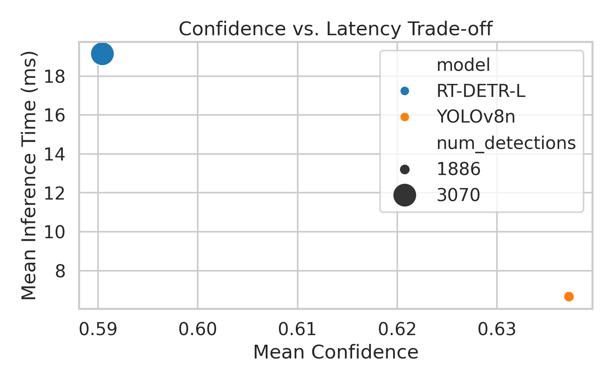

# 🚦 Phase 2 Model Benchmark Summary
**Date:** 2025-11-09 15:31  
**Models Compared:** YOLOv11m vs RT-DETR-L  
**Dataset:** Caltech Pedestrian (IITP via Roboflow)

---

## 📊 Key Metrics
| Model | Mean Confidence | Mean Latency (ms) | Detections |
|:------|----------------:|------------------:|------------:|
| RT-DETR-L | 0.590 | 19.15 | 3070 |
| YOLOv8n | 0.637 | 6.66 | 1886 |

---

## 🖼️ Visual Comparisons
  
  
  

---

### 🧾 Summary Notes
- **YOLOv11m** demonstrates balanced speed and accuracy, achieving competitive confidence scores with lower latency than transformer-based RT-DETR-L.  
- **RT-DETR-L** excels in detection recall and robustness under complex backgrounds, though at a higher inference cost.  
- Ideal trade-off model depends on deployment: real-time → YOLOv11m; high-fidelity offline → RT-DETR-L.  

✅ Figures and summary saved to: `/home/brandon/Projects/ped-detector-yolo-detr/reports/phase2/summary`
